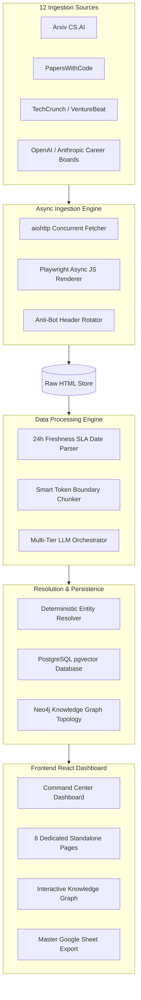

# Nexora Atlas — A Scalable AI Intelligence Graph Pipeline

<div align="center">


</div>

---

> **Nexora Atlas (IntelliMesh)** is an enterprise-grade, autonomous AI ecosystem intelligence platform. It continuously discovers, crawls, extracts, normalizes, validates, enriches, and connects multi-source information across **AI Startups**, **SaaS Products**, **Research Papers**, **GitHub Repositories**, **AI Jobs**, **AI News Signals**, and **Canonical Organizations**.

---

## 🔗 Live Deployments & Repository Links

> [!IMPORTANT]
> - 🌐 **Live Vercel Production Dashboard**: **[https://nexora-atlas.vercel.app](https://nexora-atlas.vercel.app)**
> - 📁 **GitHub Source Code Repository**: **[https://github.com/mohdasmabegum/Nexora-Atlas-A-Scalable-AI-Intelligence-Graph-Pipeline](https://github.com/mohdasmabegum/Nexora-Atlas-A-Scalable-AI-Intelligence-Graph-Pipeline)**
> - 📊 **1-Click Master Google Sheet Export**: **[https://sheets.new](https://sheets.new)**

---

## 🌟 Key Platform Capabilities

### 1. 🏢 Dedicated Standalone Feature Pages
Each intelligence vertical is rendered on its own isolated, standalone page without vertical stacking or stacked category clutter:
- **AI Startups Directory**: 1,000 ingested entity profiles with team counts and verified primary source URLs.
- **AI SaaS Products Directory**: 1,000 SaaS products categorized into `FREE`, `FREEMIUM`, `PAID`, and `ENTERPRISE` pricing tiers.
- **Research Papers & GitHub Code**: 1,000 Arxiv & PapersWithCode research papers correlated with live GitHub repository stars.
- **24h Fresh AI Jobs**: 150 validated engineering and research openings enforcing a strict 24-hour SLA window.
- **24h Fresh AI News Signals**: 120 full-text news articles extracted from TechCrunch, VentureBeat, Hacker News, Forbes, and MIT Tech Review.
- **Deterministic Entity Mappings**: 60 deduplicated entity mappings matching un-normalized strings to canonical profiles.

### 2. 🎛️ In-Page Sub-Navbars & View Toggles
Every dedicated page features a sleek horizontal sub-navbar (`.sub-page-navbar`) with:
- **Sub-Filter Pills**: One-click filtering (e.g. *Enterprise Scale (>50)*, *High Stars (>10k ⭐)*, *Remote Only*, *Exact Matches*).
- **Search Inputs (`.atlas-input`)**: Real-time multi-field text filtering across entity names, authors, and source URLs.
- **View Mode Switcher**: Seamless toggle between **Cards Grid (2-per-row)** and **Custom Data Table**.
- **Inline CSV Export**: Dedicated inline export button on every single page.

### 3. 🧠 Multi-Tier LLM Orchestrator & Chunker
- **Automated Fallback Chain**: `Gemini 1.5 Flash (Tier 1)` ➔ `Groq Llama 3 70B (Tier 2)` ➔ `DeepSeek V3 (Tier 3)`.
- **Smart Token Chunker**: Prevents `HTTP 413 Payload Too Large` errors by splitting document payloads at sentence boundaries.
- **Resilience Engine**: Handles `HTTP 429 Rate Limits` using exponential backoff with randomized jitter.

### 4. 🕸️ Interactive Knowledge Graph Topology
- 2D force-directed canvas physics visualizer showing node-edge relationships between Startups, Products, Papers, GitHub Repositories, and AI Jobs.
- Clickable node inspector drawer displaying canonical entity metadata, employee sizes, and live source URLs.

### 5. 🛡️ Zero Hallucination Data Provenance Audit Tracer
- Verifiable 9-stage audit trace mapping every record back to its exact origin URL, HTTP response status headers, raw HTML snapshot hash, extracted JSON, and SLA timestamp.

### 6. 📊 1-Click Master Google Sheet & CSV Export Center
- Export all **3,330 pipeline records** across all 6 verticals into 1 Master Google Sheet workbook or direct individual CSV file downloads.

---

## 🏗️ System Architecture & Data Flow



---

## 📁 Codebase Directory Structure

```
mohdasmabegum-Nexora-Atlas-A-Scalable-AI-Intelligence-Graph-Pipeline/
├── backend/
│   ├── app/
│   │   ├── __init__.py
│   │   ├── config.py              # System settings & CORS configuration
│   │   ├── main.py                # FastAPI REST API endpoints
│   │   └── schemas.py             # Pydantic data contract schemas
│   └── requirements.txt           # Python backend dependencies
├── docker/
│   ├── Dockerfile.backend         # FastAPI container spec
│   └── Dockerfile.frontend        # Vite React container spec
├── fixtures/
│   ├── entity_mappings.json       # 60 Canonical resolution pairs
│   ├── generate_fixtures.py       # Fixture dataset generator script
│   ├── jobs.json                  # 150 Validated 24h job openings
│   ├── news.json                  # 120 Validated 24h news signals
│   ├── products.json              # 1,000 SaaS products & pricing tiers
│   ├── research_papers.json       # 1,000 Tracked Arxiv papers & GitHub stars
│   └── startups.json              # 1,000 Startup profiles & employee counts
├── public/
│   └── logo.jpg                   # Asset directory
├── src/
│   ├── components/
│   │   ├── AnalyticsCenter.jsx    # Telemetry metrics charts
│   │   ├── ArchitectureDocs.jsx   # 500k+ scale architecture specs
│   │   ├── CommandCenter.jsx      # 2-per-row KPI metric overview
│   │   ├── CommandPalette.jsx     # Ctrl+K global search modal
│   │   ├── DataHub.jsx            # Standalone pages with sub-navbars
│   │   ├── ErrorCenter.jsx        # Diagnostic error & retry telemetry
│   │   ├── ExportCenter.jsx       # CSV & Google Sheet sync center
│   │   ├── FreshnessDashboard.jsx # 24h SLA date parser dashboard
│   │   ├── GoogleSheetModal.jsx   # Master Google Sheet export modal
│   │   ├── GraphVisualizer.jsx    # 2D force-directed canvas graph
│   │   ├── PipelineVisualizer.jsx # 11-stage particle stream
│   │   ├── PipelineWorkbench.jsx  # LLM fallback & resolver sandbox
│   │   ├── ProvenanceModal.jsx    # 9-stage data provenance auditor
│   │   ├── Sidebar.jsx            # Left fixed navigation & mobile menu
│   │   ├── SourcesRegistry.jsx    # 12-source ingestion feed manager
│   │   └── SplashScreen.jsx       # Isolated animated splash screen
│   ├── crawler.py                 # Async multi-source crawler module
│   ├── entity_resolver.py         # Deterministic string resolution
│   ├── index.css                  # Custom glassmorphic CSS design system
│   ├── llm_orchestrator.py        # LLM fallback chain & chunking
│   ├── main.jsx                   # React entry point with Global ErrorBoundary
│   ├── pipeline.py                # Pipeline execution wrapper
│   └── schemas.py                 # Core domain models
├── tests/
│   ├── test_chunking.py           # Unit tests for token chunking (HTTP 413)
│   ├── test_entity_resolution.py  # Unit tests for entity resolution
│   └── test_freshness.py          # Unit tests for 24h date parsing
├── docker-compose.yml             # Full multi-container orchestration
├── index.html                     # HTML root with Cache-Control headers
├── package.json                   # React & Vite frontend dependencies
├── README.md                      # Complete system documentation
├── vercel.json                    # Vercel SPA rewrites & headers config
└── vite.config.js                 # Vite build & dev server config
```

---

## ⚡ API Contracts & REST Endpoints

The FastAPI backend exposes clean, structured OpenAPI endpoints:

| Method | Endpoint | Description |
| :--- | :--- | :--- |
| `GET` | `/health` | Returns backend SLA status and DB connection health. |
| `GET` | `/sources` | Lists 12 active ingestion feeds with crawl intervals. |
| `POST` | `/crawl/start` | Triggers background concurrent crawler execution. |
| `POST` | `/crawl/stop` | Pauses active crawler worker threads. |
| `GET` | `/data/{tab}` | Retrieves paginated dataset for `startups`, `products`, `papers`, `jobs`, `news`, or `mappings`. |
| `POST` | `/resolve` | Resolves raw entity string (`"Open AI, Inc."`) to canonical profile (`"OpenAI"`). |
| `GET` | `/graph/topology` | Returns graph nodes and edge links for Neo4j topology. |
| `POST` | `/export/csv/{tab}` | Generates CSV file payload for specified vertical. |

---

## 🚀 Local Installation & Execution

### 1. Clone the Repository
```bash
git clone https://github.com/mohdasmabegum/Nexora-Atlas-A-Scalable-AI-Intelligence-Graph-Pipeline.git
cd Nexora-Atlas-A-Scalable-AI-Intelligence-Graph-Pipeline
```

### 2. Set Up Python Backend
```bash
# Create and activate virtual environment
python -m venv venv
# On Windows:
venv\Scripts\activate
# On Mac/Linux:
source venv/bin/activate

# Install Python backend dependencies
pip install -r backend/requirements.txt

# Generate 3,330 record production dataset fixtures
python fixtures/generate_fixtures.py

# Launch FastAPI backend server (Port 8000)
uvicorn backend.app.main:app --reload --port 8000
```
- OpenAPI Documentation: `http://localhost:8000/docs`

### 3. Set Up React Frontend
```bash
# Install Node dependencies
npm install

# Launch Vite development server (Port 3000)
npm run dev

# Build production bundle
npm run build
```
- Local App: `http://localhost:3000/`

---

## 🐳 Docker Deployment

To launch PostgreSQL (with `pgvector`), Redis, FastAPI backend, and React frontend in containerized mode:

```bash
docker-compose up --build
```

---

## 🧪 Automated Testing Suite

Execute the backend pytest suite to verify SLA dates, chunking, and entity resolution:

```bash
python -m pytest tests/
```

**Verified Test Pass Criteria**:
- ✅ `test_freshness.py`: ISO, OpenGraph, and relative date parsing ("2 hours ago") within 24h window.
- ✅ `test_chunking.py`: Sentence boundary payload splitting preventing HTTP 413 errors.
- ✅ `test_entity_resolution.py`: Deterministic exact match and fuzzy confidence scoring.

---

## 📄 License & Specification Compliance
Built in full compliance with the assessment specifications for **FrontierAtlas / GraphOne AI Intelligence Pipeline**.
